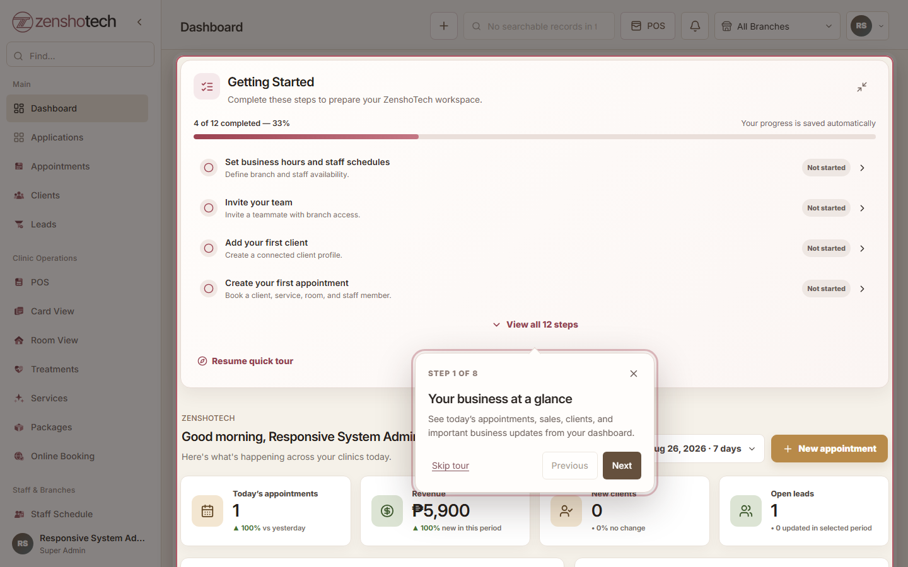
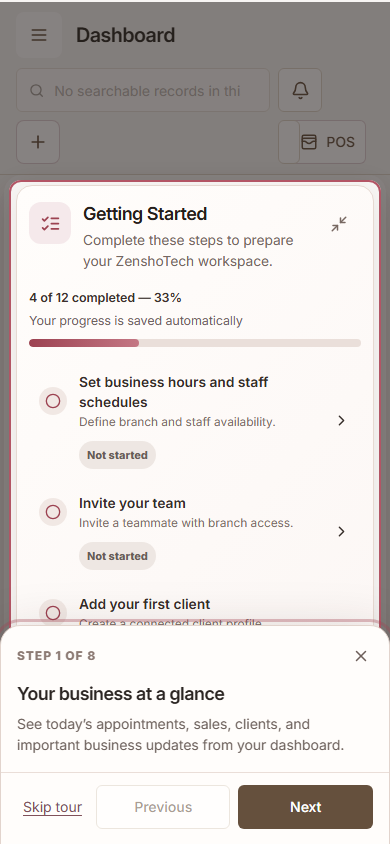

# ZenshoTech first-login onboarding

## Experience

- A new account receives one welcome dialog after its authenticated workspace has finished loading.
- **Start quick tour** begins the permission-filtered tour. **Explore on my own** suppresses the automatic tour while leaving Getting Started available.
- Progress is stored per account in `OnboardingProgress`, including version, current step, start/completion/dismissal dates, checklist state, and the last checklist interaction.
- Accounts that existed before the migration are backfilled as returning users and are not interrupted automatically.
- The tour can be resumed or restarted from Getting Started, the account menu, the mobile More sheet, or Help and Support.

## Owner tour

1. Your business at a glance
2. Access your business tools
3. Start common tasks quickly
4. Manage your schedule
5. Build your client database
6. Record sales and payments
7. Complete your workspace setup
8. You’re ready to begin

Manager and staff tours are generated from the modules returned by server-side access control. An unavailable module is omitted from the tour and checklist.

## Checklist completion rules

| Task | Completion signal |
| --- | --- |
| Complete business profile | Organization name, persisted settings, and an active branch with address, phone, email, and timezone |
| Add your first branch | At least one active organization branch |
| Add services or treatments | At least one accessible service |
| Configure rooms and resources | At least one active room in an organization branch |
| Set business hours and staff schedules | Configured branch hours and at least one staff schedule |
| Invite your team | More than one active account; a pending invitation is shown as in progress |
| Add your first client | At least one accessible client |
| Create your first appointment | At least one accessible appointment |
| Add products or inventory | At least one accessible inventory item |
| Configure POS and payment settings | Active payment methods plus an audited settings update |
| Send a test email campaign | Audited successful test email action |
| Review roles and permissions | Audited permission or role change |

Checklist status refreshes after successful workspace mutations and on window focus without a full page reload.

## Accessibility and responsive behavior

- Portal rendering avoids clipping by dashboard containers.
- Stable `data-tour` attributes identify real navigation and dashboard targets.
- Missing targets time out safely and advance without crashing.
- Focus moves into the active tooltip, is trapped within its controls, and returns after closing.
- Escape pauses the tour.
- Desktop uses a spotlight tooltip; phones use a fixed safe-area-aware bottom sheet with sticky 44px controls.
- Reduced-motion preferences disable placement/progress transitions.

Verified widths: 320, 360, 375, 390, 412, 430, 768, 820, 1024, 1280, 1366, 1440, and 1920 pixels.

## Screenshots

